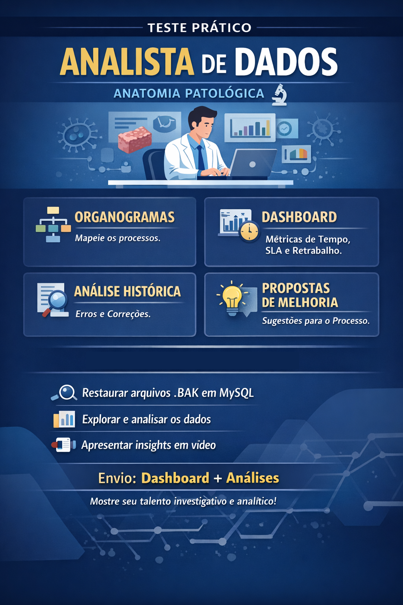

--- 

# Comunicação

Toda a comunicação a respeito deste teste deve ser feita através do email por onde o candidato o recebeu. 

# Entrega

O prazo para entrega do teste é de 10 dias após seu envio ao candidato.
O teste pode ser entregue parcialmente, porém a porcentagem de aderencia ao escopo total será avaliada.

## Teste Prático — Analista de Dados

Base anonimizada de casos, histórico e eventos de Anatomia Patológica

Arquivos fornecidos na pasta public/bak:

tabela_requisicao.bak
tabela_evento.bak
tabela_historico_requisicao.bak

### Parte 0 — Preparação

O candidato deve:

Restaurar os arquivos .bak em um banco MySQL
Explorar a estrutura das tabelas
Entender relacionamentos

Os arquivos estão em formato de backup. Fique à vontade para utilizar qualquer ferramenta para restaurar e explorar os dados.

### Parte 1 — Entendimento do Negócio

O candidato deve criar organogramas dos 3 principais fluxos das requisições dentro do sistema, com base nos dados fornecidos.

Identificar: Estados possíveis (eventos), Ordem do processo, bifurcações, Pontos de início e fim.

### Parte 2 — Construção de Métricas

O candidato deve construir dashboard com as seguintes métricas:

2.1 Tempo total de processamento
Do primeiro evento até o evento final
2.2 Tempo por etapa
Tempo médio entre eventos consecutivos
2.3 SLA
Usando o SLA (Evento.Prazo) calcular % dentro do prazo e atrasados
2.4 Volume
Quantidade de requisições por dia por Exame
2.5 Retrabalho
Casos com eventos repetidos ações no histórico que indicam correção

Responda:

Onde estão os maiores gargalos?
Existe etapa com maior tempo médio?
Há aumento de volume em algum período?
Casos com retrabalho demoram mais?

### Parte 3 — Análise do Histórico

O candidato deve usar a tabela de histórico para complementar a análise

Investigar:

Quais ações são mais comuns?
Existe padrão de erro/correção?

### Parte 4 — Propostas de Melhoria

Com base na sua análise, o que você melhoraria no processo?

### Parte 5 — Apresentação

O candidato deve apresentar os principais insights como se estivesse falando com um diretor.
Video de apresentação é extremamente indicado, mas pode ser feito através de chamada de video ao vivo mediante agendamento prévio.
